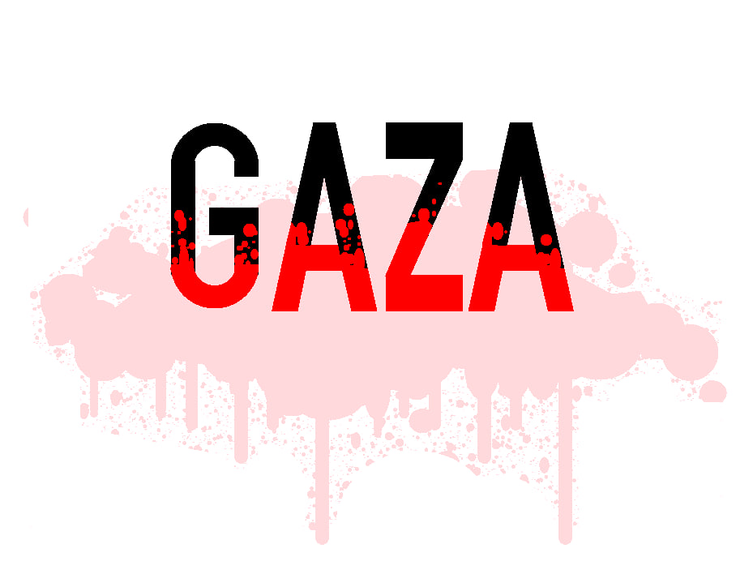

# March for Gaza – A Visual Representation

This project is a **Computer Graphics Lab** work visualizing the **Gaza Mass Genocide** using **OpenGL GLUT in C++**. It consists of three powerful static images representing the destruction of Gaza, the identity of the Palestinian people, and the global solidarity movement.

> 🕊️ **"From the river to the sea, Palestine will be free."**

---

## 📷 Project Overview

The project contains **three visual scenes**:
1. **Scene 1 – GAZA Text with Blood:**  
   A symbolic representation of the word "GAZA" with blood dripping and scattered blood in the background.

2. **Scene 2 – Destroyed City of Gaza:**  
   Shows broken buildings, burnt vehicles, and smoke—symbolizing brutal destruction by Israeli airstrikes.

3. **Scene 3 – Palestine Map and Flag:**  
   Displays the red map of Palestine, the green Gaza Strip, the flag of Palestine, and the slogan:  
   *"From the river, to the sea, Palestine will be free."*

Use the **left (←)** and **right (→)** arrow keys to switch between these three scenes.

---

## 💻 Prerequisites

Make sure the following are installed on your PC:

- **VS Code**
- **MinGW Compiler**
- **Run++ Extension** ([Install here](https://marketplace.visualstudio.com/items?itemName=AlbinBD.run))

---

## 🚀 How to Run the Project

1. **Clone the repository:**
   ```bash
   git clone https://github.com/your-username/march-for-gaza.git
   ```

2. **Open the project in VS Code.**

3. **Make sure MinGW is added to your system PATH.**

4. **Install the `Run++` extension** from the VS Code Marketplace.

5. **Open `main.cpp` in the editor.**

6. **Press `Alt + B`** to compile and run the project.

> Use ← and → arrow keys to navigate through the 3 screens.

---

## 🙋 Author

**👤 Md Shefat Al Mahmud**  
4th Year Student, Dept. of CSE  
Daffodil International University

---

## 📜 License

This project is released under the [MIT License](LICENSE) for educational and awareness purposes. Feel free to fork and build upon it to spread the message further.

---

🇵🇸 **Free Palestine.**

## 🖼️ Screenshots

### 🖼️ Scene 1 – GAZA Text with Blood  
A symbolic representation of the word "GAZA" with blood dripping and scattered blood in the background.  


### 🏚️ Scene 2 – Destroyed City of Gaza  
Shows broken buildings, burnt vehicles, and smoke—symbolizing brutal destruction by Israeli airstrikes.  


### 🗺️ Scene 3 – Palestine Map and Flag  
Displays the red map of Palestine, the green Gaza Strip, the flag of Palestine, and the slogan:  
**"From the river, to the sea, Palestine will be free."**  
